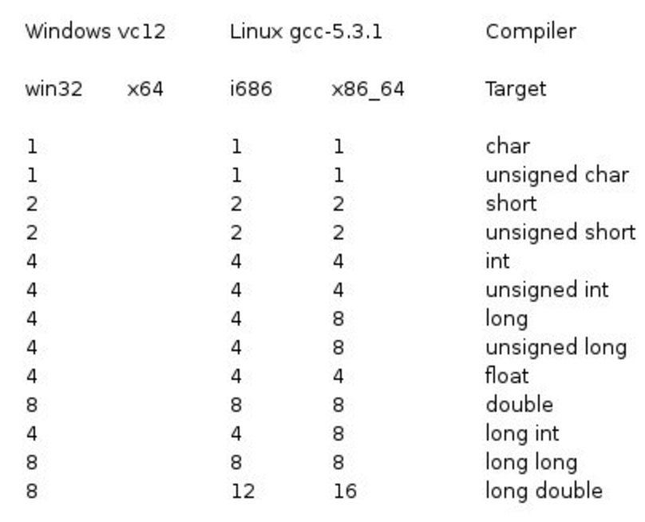
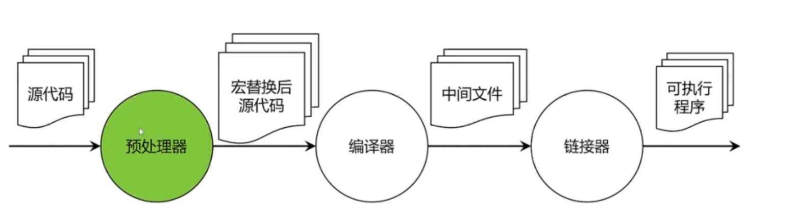
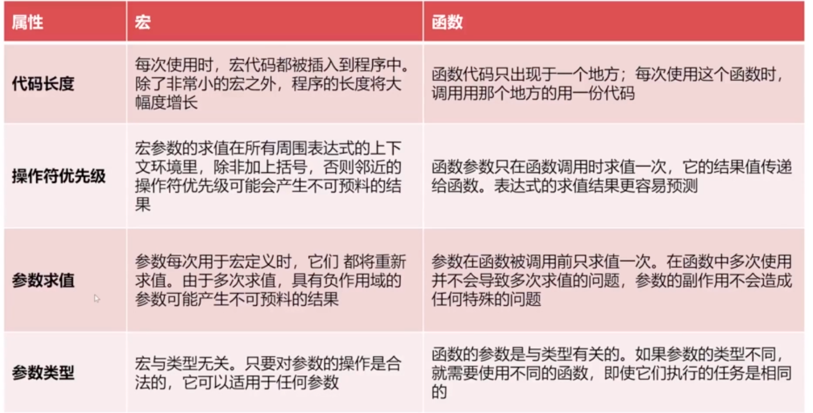

## 版本差异

- C89/C90：这是第一个正式的C语言标准，由美国国家标准协会（ANSI）制定，后被国际标准化组织（ISO）采纳。这个版本的C语言定义了C标准库，引入了函数原型、const、volatile等新关键字，以及宽字符、宽字符串和多字节字符等特性12。
- C95：这是对C89/C90的一个修订和扩充，增加了三个新的标准头文件（iso646.h、wctype.h、wchar.h），以及一些新的格式符和宽字符函数12。
- C99：这是第二个正式的C语言标准，由ISO发布。这个版本的C语言增加了复数、整数类型扩展、变长数组、布尔类型、非英语字符集的支持、浮点类型的支持、C++风格注释等特性123。
- C11：这是第三个正式的C语言标准，由ISO发布。这个版本的C语言引入了字节对齐说明符、泛型机制、对多线程的支持、静态断言、原子操作以及对Unicode的支持等特性123。
- C17/C18：这是对C11的一个修订和补充，并不是一个真正的新标准。这个版本的C语言没有引入新的语言特性，只对C11进行了一些错误修正和澄清123。
- C2x：这是下一个版本的C语言标准，预计将于2022年12月完成。目前还不清楚这个版本会有哪些新的特性12。


## 数据结构



1字节 8位 

基本数据类型有三种：字符（char）、整数（int）和浮点数（float）。复杂的类型都是基于它们构建的。

### 有无符号

最高位如果是 1，表明这个数是负数，其值为除 最 高 位 以 外 的 剩 余 位 的 值 添 上 这 个 的- ” 号 ; 如 果 最 高 位 是 0 ， 表 明 这 个 数 是 正 数 ， 其 值 为 除 最 高 位 以 外 的 剩 余位 的 值 。
### 获取数据类型的极限

- SCHAR_MIN，SCHAR_MAX：signed char 的最小值和最大值。
- SHRT_MIN，SHRT_MAX：short 的最小值和最大值。
- INT_MIN，INT_MAX：int 的最小值和最大值。
- LONG_MIN，LONG_MAX：long 的最小值和最大值。
- LLONG_MIN，LLONG_MAX：long long 的最小值和最大值。
- UCHAR_MAX：unsigned char 的最大值。
- USHRT_MAX：unsigned short 的最大值。
- UINT_MAX：unsigned int 的最大值。
- ULONG_MAX：unsigned long 的最大值。
- ULLONG_MAX：unsigned long long 的最大值

### 占位符

- %a：十六进制浮点数，字母输出为小写。
- %A：十六进制浮点数，字母输出为大写。
- %c：字符。
- %d：十进制整数。
- %e：使用科学计数法的浮点数，指数部分的e为小写。
- %E：使用科学计数法的浮点数，指数部分的E为大写。
- %i：整数，基本等同于%d。
- %f：小数（包含float类型和double类型）。
- %g：6个有效数字的浮点数。整数部分一旦超过6位，就会自动转为科学计数法，指数部分的e为小写。
- %G：等同于%g，唯一的区别是指数部分的E为大写。
- %hd：十进制 short int 类型。
- %ho：八进制 short int 类型。
- %hx：十六进制 short int 类型。
- %hu：unsigned short int 类型。
- %ld：十进制 long int 类型。
- %lo：八进制 long int 类型。
- %lx：十六进制 long int 类型。
- %lu：unsigned long int 类型。
- %lld：十进制 long long int 类型。
- %llo：八进制 long long int 类型。
- %llx：十六进制 long long int 类型。
- %llu：unsigned long long int 类型。
- %Le：科学计数法表示的 long double 类型浮点数。
- %Lf：long double 类型浮点数。
- %n：已输出的字符串数量。该占位符本身不输出，只将值存储在指定变量之中。
- %o：八进制整数。
- %p：指针。
- %s：字符串。
- %u：无符号整数（unsigned int）。
- %x：十六进制整数。
- %zd：size_t类型。
- %%：输出一个百分号。

```c
printf("%5d\n", 123); // 输出为 "  123"
printf("%-5d\n", 123); // 输出为 "123  "
```

## C语言的编译过程




## 宏函数



## 字节序


## <time.h>

- size_t：无符号整数类型，用于表示对象或数组的大小。
- clock_t：整数类型，用于表示处理器时间。
- time_t：整数类型，用于表示日历时间，即从1970年1月1日00:00:00 UTC开始经过的秒数。
- struct tm：结构体类型，用于表示分解后的日期和时间，包含以下成员：
```c
struct tm {
  int tm_sec;   /* 秒，范围从 0 到 59 */
  int tm_min;   /* 分，范围从 0 到 59 */
  int tm_hour;  /* 小时，范围从 0 到 23 */
  int tm_mday;  /* 一月中的第几天，范围从 1 到 31 */
  int tm_mon;   /* 月，范围从 0 到 11 */
  int tm_year;  /* 自 1900 年起的年数 */
  int tm_wday;  /* 一周中的第几天，范围从 0 到 6 */
  int tm_yday;  /* 一年中的第几天，范围从 0 到 365 */
  int tm_isdst; /* 夏令时 */
};
```

### asctim

```c
char *asctime(const struct tm *timeptr);
/*
它的作用是将一个struct tm类型的指针转换为一个字符串指针，表示日期和时间
Www Mmm dd hh:mm:ss yyyy\n\0
*/

#include <stdio.h>
#include <time.h>
int main() {
  struct tm t;
  t.tm_sec = 10;   // 秒，范围从 0 到 59
  t.tm_min = 49;   // 分，范围从 0 到 59
  t.tm_hour = 10;  // 小时，范围从 0 到 23
  t.tm_mday = 21;  // 日，范围从 1 到 31
  t.tm_mon = 10;   // 月，范围从 0 到 11
  t.tm_year = 116; // 年，从1900年开始计算
  t.tm_wday = 5;   // 星期，范围从 0 到 6
  printf("%s", asctime(&t));
  //Fri Nov 21 10:49:10 2016
  return 0;
}
```

### clock

```c
clock_t clock(void);
/*
它的作用是返回程序执行起（一般为程序的开头），处理器时钟所使用的时间。返回值的类型是clock_t，它是一个整数类型。为了获取CPU所使用的秒数，需要除以CLOCKS_PER_SEC宏。这个宏在不同的平台上可能有不同的值，通常在Windows上是1000，在Linux上是1000000。
*/
#include <stdio.h>
#include <time.h>
int main() {
  clock_t start_t, end_t, total_t;
  int i;
  
  start_t = clock(); // 记录开始时间
  printf("程序启动，start_t = %ld\n", start_t);
  
  printf("开始一个大循环...\n");
  
  for(i=0; i<10000000; i++) {
    // do nothing
  }
  
  end_t = clock(); // 记录结束时间
  printf("大循环结束，end_t = %ld\n", end_t);
  
  total_t = end_t - start_t; // 计算差值
  printf("total_t = %ld\n", total_t);
  
  printf("CPU 占用的总时间：%f\n", (double)total_t / CLOCKS_PER_SEC); // 转换为秒数
  
  printf("程序退出...\n");
  
}
/*
程序启动，start_t = -1
开始一个大循环...
大循环结束，end_t = -1
total_t = -2
CPU 占用的总时间：-0.000002
程序退出...

*/

```

## 文件操作

- 使用fopen函数打开一个文件，指定文件名和访问模式，如只读、只写、追加等。如果打开成功，fopen函数返回一个FILE类型的指针，否则返回NULL。例如：
```c
FILE *fp = fopen("test.txt", "r"); //打开一个名为test.txt的文本文件，以只读模式
if (fp == NULL) {
  printf("打开文件失败\n");
  return;
}
```

- 使用fread、fwrite、fgetc、fputc、fgets、fputs、fprintf、fscanf等函数来读写文件中的数据。这些函数都需要传入一个FILE类型的指针作为参数，以及要读写的数据和大小。例如：
```c
char ch = fgetc(fp); //从文件中读取一个字符
fputc(ch, stdout); //将字符输出到标准输出
char str[100];
fgets(str, 100, fp); //从文件中读取一行字符串，最多100个字符
fputs(str, stdout); //将字符串输出到标准输出
int a = 10, b = 20;
fprintf(fp, "%d + %d = %d\n", a, b, a + b); //将格式化的字符串写入文件
fscanf(fp, "%d + %d = %d\n", &a, &b, &c); //从文件中读取格式化的数据
```

- 使用fclose函数关闭打开的文件，释放资源。如果关闭成功，fclose函数返回0，否则返回EOF。例如：
```c
if (fclose(fp) == 0) {
  printf("关闭文件成功\n");
} else {
  printf("关闭文件失败\n");
}
```
