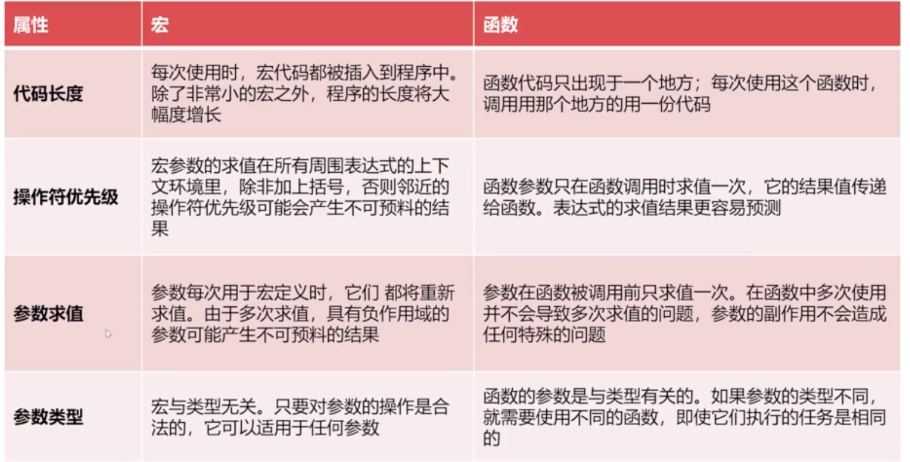

## 数据结构


1字节 8位 

基本数据类型有三种：字符（char）、整数（int）和浮点数（float）。复杂的类型都是基于它们构建的。


## 占位符

- %a：十六进制浮点数，字母输出为小写。
- %A：十六进制浮点数，字母输出为大写。
- %c：字符。
- %d：十进制整数。
- %e：使用科学计数法的浮点数，指数部分的e为小写。
- %E：使用科学计数法的浮点数，指数部分的E为大写。
- %i：整数，基本等同于%d。
- %f：小数（包含float类型和double类型）。
- %g：6个有效数字的浮点数。整数部分一旦超过6位，就会自动转为科学计数法，指数部分的e为小写。
- %G：等同于%g，唯一的区别是指数部分的E为大写。
- %hd：十进制 short int 类型。
- %ho：八进制 short int 类型。
- %hx：十六进制 short int 类型。
- %hu：unsigned short int 类型。
- %ld：十进制 long int 类型。
- %lo：八进制 long int 类型。
- %lx：十六进制 long int 类型。
- %lu：unsigned long int 类型。
- %lld：十进制 long long int 类型。
- %llo：八进制 long long int 类型。
- %llx：十六进制 long long int 类型。
- %llu：unsigned long long int 类型。
- %Le：科学计数法表示的 long double 类型浮点数。
- %Lf：long double 类型浮点数。
- %n：已输出的字符串数量。该占位符本身不输出，只将值存储在指定变量之中。
- %o：八进制整数。
- %p：指针。
- %s：字符串。
- %u：无符号整数（unsigned int）。
- %x：十六进制整数。
- %zd：size_t类型。
- %%：输出一个百分号。

```c
printf("%5d\n", 123); // 输出为 "  123"
printf("%-5d\n", 123); // 输出为 "123  "
```

## C语言的编译过程


## 宏函数

